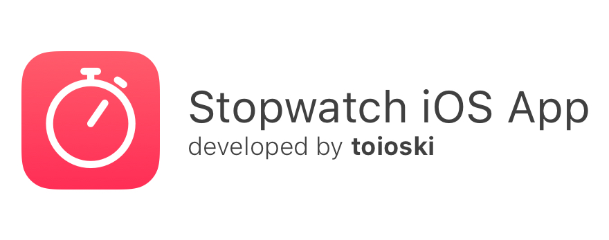
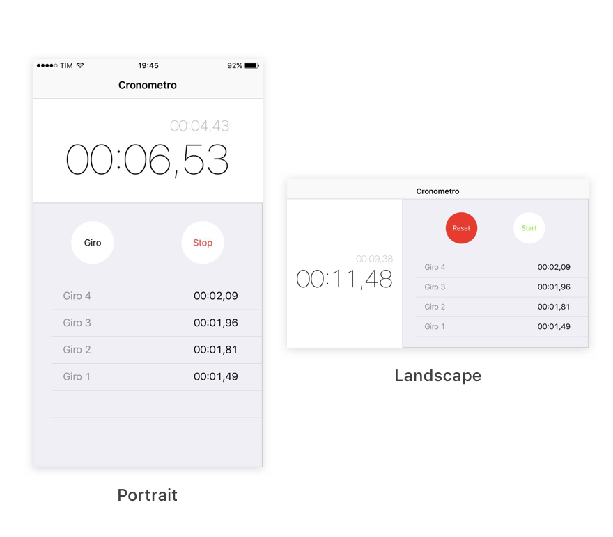

##Description
A Swift 2 and Xcode 7 implementation of the default iOS 9 Stopwatch app

##Requirements
Requires Xcode 7 and Swift 2

##Installation
Just clone the repo (or download the zip), open Stopwatch.xcodeproj and press CMD+B 

##License
Stopwatch is released under the GNU V3.0 license. See LICENSE for details.
